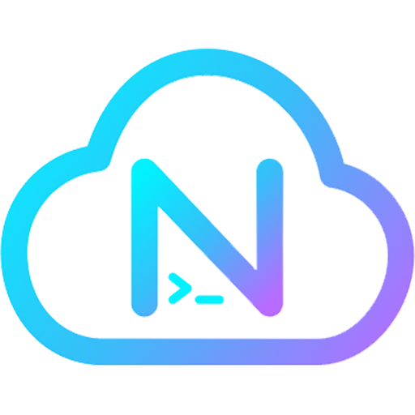
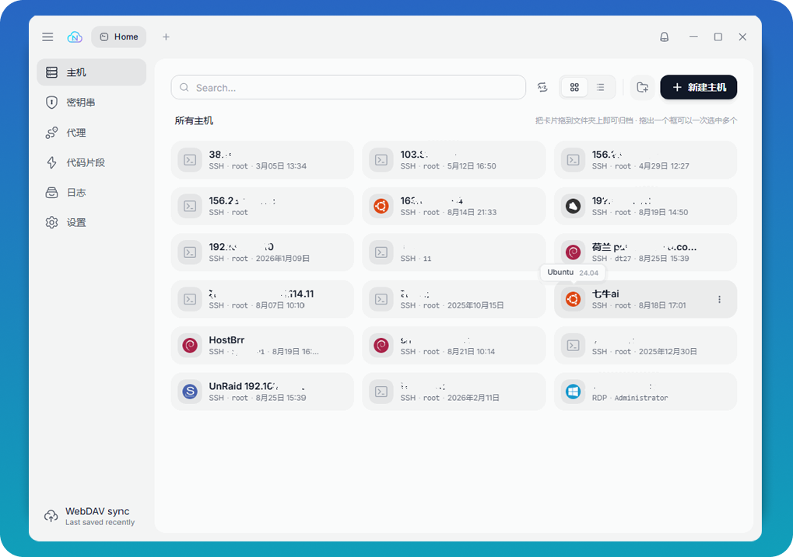
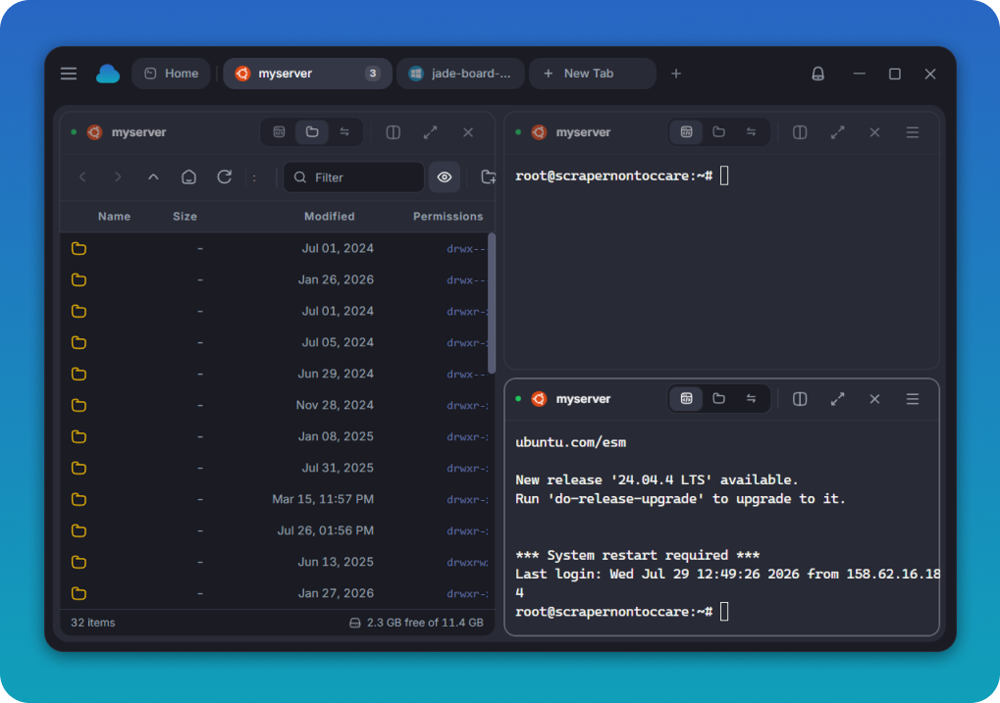
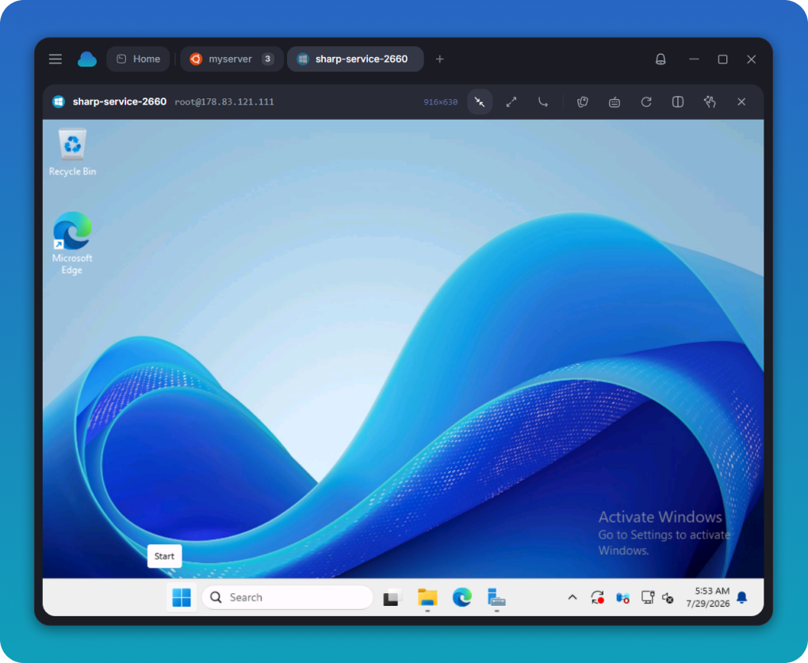
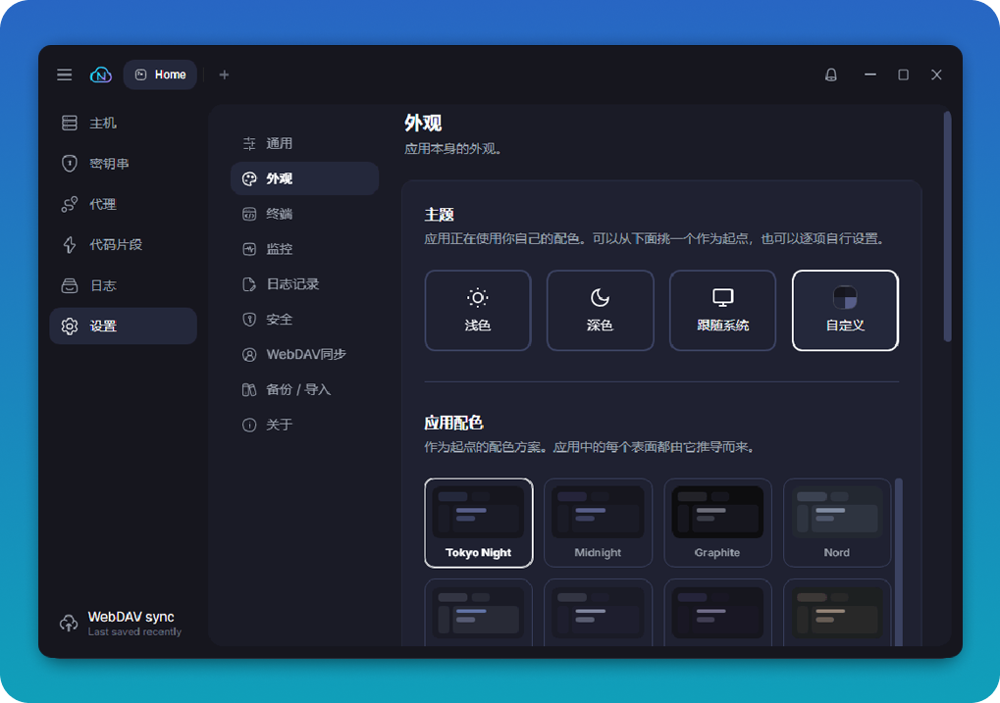

<p align="center">
  
</p>

<h1 align="center">NoxSSH</h1>

<p align="center">
  <strong>Una herramienta moderna, segura y multiprotocolo para conexiones remotas con sincronización WebDAV privada</strong>
</p>

<p align="center">
  SSH · SFTP · Telnet · Serie · RDP · VNC<br/>
  Terminales divididos · Transferencia de archivos · Reenvío de puertos · Sincronización WebDAV privada
</p>

<p align="center">
  <a href="https://github.com/DT27/NoxSSH/releases/latest"></a>
  &nbsp;
  
  &nbsp;
  <a href="LICENSE"></a>
</p>

<p align="center">
  <a href="./README.md">简体中文</a> ·
  <a href="./README.en.md">English</a> ·
  <a href="./README.ja.md">日本語</a> ·
  <a href="./README.ko.md">한국어</a> ·
  <strong>Español</strong> ·
  <a href="./README.ru.md">Русский</a>
</p>

---



NoxSSH está pensado para desarrolladores y administradores que gestionan servidores,
equipos de red y escritorios remotos con frecuencia. Reúne terminales, gestión de
archivos, reenvío de puertos y escritorios remotos en una aplicación de escritorio,
con sincronización de la configuración entre dispositivos mediante WebDAV.

## Puntos destacados

- **Conecta cualquier entorno desde una sola aplicación:** administra sesiones SSH, SFTP, Telnet, serie, RDP y VNC.
- **Espacio de trabajo eficiente:** pestañas, paneles divididos flexibles, entrada simultánea, restauración de sesiones, búsqueda y grabación.
- **Sincronización WebDAV:** hosts, claves, fragmentos, proxies, hosts conocidos y ajustes del terminal se cifran localmente antes de subirlos.
- **Historial independiente:** crea copias versionadas de forma programada o manual y restaura o elimina una sin modificar la instantánea actual.
- **Migración sencilla:** importa datos de OpenSSH, PuTTY, KiTTY, MobaXterm y NextSSH.
- **Red mínima de forma predeterminada:** no incluye telemetría y la comprobación automática de actualizaciones está desactivada hasta que la habilites; la comprobación manual siempre está disponible.

NoxSSH se basa en [CloudTerm](https://github.com/BradPerbs/cloudterm) y sustituye su sincronización en la nube basada en cuentas por WebDAV.

---

## Contenido

- [Características](#features)
- [Capturas](#screenshots)
- [Primeros pasos](#getting-started)
- [Participar](#community)
- [Tecnología](#tech-stack)
- [Licencia](#license)

---

<a name="features"></a>

## Características

### Terminal

- **Paneles divididos flexibles** en horizontal o vertical, con ampliación de panel y pantalla completa
- **Pestañas y grupos** con nombres y colores personalizados, restaurados en el siguiente inicio
- **Temas claros y oscuros** con fuentes y colores personalizables
- **Búsqueda en el historial y enlaces pulsables**, con expresiones regulares
- **Entrada simultánea** para controlar varias sesiones a la vez
- **Grabación de sesiones y capturas** para diagnóstico y documentación

### Conexiones

- **Conexiones SSH, Telnet y serie** en la misma ventana
- **Hosts de salto** para conectarse a través de bastiones
- **Proxies SOCKS5, SOCKS4 y HTTP**, reutilizados por terminales, SFTP, reenvío de puertos y escritorios remotos
- **Contraseñas, claves, agente SSH, certificados** y claves de Windows Hello protegidas por TPM
- **Autenticación interactiva y 2FA**
- **Reconexión automática** tras interrupciones de red o al reactivar el sistema
- **Comandos al conectar** ejecutados automáticamente después de cada conexión correcta

### Archivos y red

- **Gestor SFTP completo**: transferencias recursivas, reanudación, resolución de conflictos y arrastrar y soltar
- **Edita archivos remotos** en tu propio editor, subidos en cada guardado
- **Reenvío de puertos**: local, remoto y SOCKS5 dinámico, con contadores de tráfico en vivo
- **Escritorios remotos**: RDP y VNC en un panel, tunelizados por SSH

### Datos y migración

- **Sincronización WebDAV cifrada:** los datos se cifran localmente con la frase de sincronización antes de subirlos. **La frase de sincronización solo se guarda en el dispositivo; si se pierde, los datos remotos no se podrán descifrar. La contraseña de WebDAV solo se usa para autenticar la conexión.**
- **Copias históricas** que se pueden crear, restaurar y eliminar por separado sin sobrescribir la instantánea de sincronización actual
- **Copias locales cifradas** para exportar toda la configuración e importarla en otro dispositivo
- **Importación desde varias fuentes:** OpenSSH, PuTTY, KiTTY, MobaXterm y NextSSH

<a name="operating-systems"></a>

### Detección del sistema operativo

El sistema operativo se detecta al conectar, y su icono y versión se muestran en la tarjeta del host.

<p align="center">
  
  
  
  
  
  
  
  
  
  
  <br/>
  
  
  
  
  
  
  
  
  
  
  <br/>
  
  
  
  
  
  
  
  
  
  
  <br/>
  
  
  
  
  
  <picture><source media="(prefers-color-scheme: dark)" srcset="docs/logos/macos-dark.svg"></picture>
</p>

### Seguridad

- **Almacén cifrado** para cada credencial, tras una contraseña de apertura
  opcional
- **Verificación de claves de host** en cada conexión y en cada salto
- **Sincronización WebDAV**, cifrada en tu equipo con una frase de sincronización antes de subirse; las copias históricas se pueden restaurar o borrar una a una
- **Copias de seguridad cifradas** que llevan toda tu configuración a otro equipo
- **Registro de actividad** de cada conexión y cada cambio

---

<a name="screenshots"></a>

## Capturas

### Sincronización WebDAV y copias históricas


### Paneles divididos y SFTP



### Windows RDP



### Temas y colores



---

<a name="getting-started"></a>

## Primeros pasos

<a name="download"></a>

### Descargas

Descarga el paquete adecuado para tu plataforma desde la [última versión](https://github.com/DT27/NoxSSH/releases/latest):

| SO | Arquitectura | Nombre del archivo |
| -- | ------------ | ------------------ |
| Windows | x64 | `NoxSSH-Setup-v<versión>-x64.exe` (instalador, recomendado) o `NoxSSH-v<versión>-x64.exe` (portable) |
| macOS | Apple silicon / Intel | `NoxSSH-v<versión>-arm64.dmg` o `NoxSSH-v<versión>-x64.dmg` |
| Linux | x64 | `NoxSSH-v<versión>-x64.AppImage` |

También puedes consultar [todas las versiones en GitHub](https://github.com/DT27/NoxSSH/releases).

### Compilar desde el código fuente

Requiere Node.js 20 o posterior y npm.

```bash
git clone https://github.com/DT27/NoxSSH.git
cd NoxSSH
npm install
npm run dev
```

Genera el paquete de distribución para la plataforma actual en `dist/`:

```bash
npm run build
```

### Atajos

|                      |                        |                |                       |
| -------------------- | ---------------------- | -------------- | --------------------- |
| `Ctrl+Shift+F`       | Buscar en el historial | `Alt+Shift+=`  | Dividir a la derecha  |
| `Ctrl+Shift+K`       | Paleta de fragmentos   | `Alt+Shift+-`  | Dividir abajo         |
| `Ctrl+Shift+B`       | Entrada difundida      | `Alt+Shift+Z`  | Ampliar panel         |
| `Ctrl+Shift+C` / `V` | Copiar y pegar         | `Ctrl+Shift+W` | Cerrar panel          |
| `Alt+Flechas`        | Moverse entre paneles  |                |                       |

<a name="community"></a>

## Participar

- Informa de errores o solicita funciones en [Issues](https://github.com/DT27/NoxSSH/issues).
- Envía correcciones y nuevas funciones mediante [Pull Requests](https://github.com/DT27/NoxSSH/pulls).
- Ejecuta `npm test` y `npm run build:renderer` antes de enviar cambios.

<a name="contributors"></a>

## Colaboradores

Gracias a todas las personas que mantienen y mejoran NoxSSH:

<a href="https://github.com/DT27/NoxSSH/graphs/contributors">
  
</a>

Gracias también a todos los colaboradores del proyecto original CloudTerm.

<a name="tech-stack"></a>

## Tecnología

Electron · React · xterm.js · ssh2 · IronRDP (WebAssembly) · noVNC · Tailwind ·
Vite

`src/main/` es el proceso principal de Electron, un módulo por función.
`src/renderer/` es la interfaz React: `components/` por función, `hooks/` para el
estado y `lib/` para funciones puras.

<a name="license"></a>

## Licencia

**NoxSSH** es un fork de [CloudTerm](https://github.com/BradPerbs/cloudterm).

Este proyecto se distribuye bajo la [Licencia CloudTerm](LICENSE) original (fair-code).

- El código es abierto y se puede leer.
- El software se puede usar, modificar y compartir gratuitamente (incluidos forks), tanto para uso personal como interno de una empresa.
- Venderlo, incluir cualquier parte en un producto o servicio de pago, ofrecerlo como servicio alojado de pago o distribuirlo de cualquier otro modo con fines comerciales **requiere una licencia comercial aparte** de CloudBlast.

Debes conservar la licencia y el aviso de copyright originales en cualquier copia o parte sustancial que distribuyas.

Puedes decir con exactitud que este trabajo deriva de CloudTerm.
No puedes llamar a este proyecto «CloudTerm» ni presentarlo como si viniera de CloudBlast.

Texto completo: [LICENSE](LICENSE) | https://faircode.io

Proyecto original: https://github.com/BradPerbs/cloudterm (CloudBlast)
