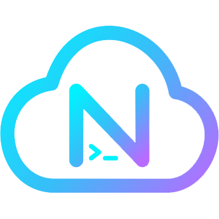
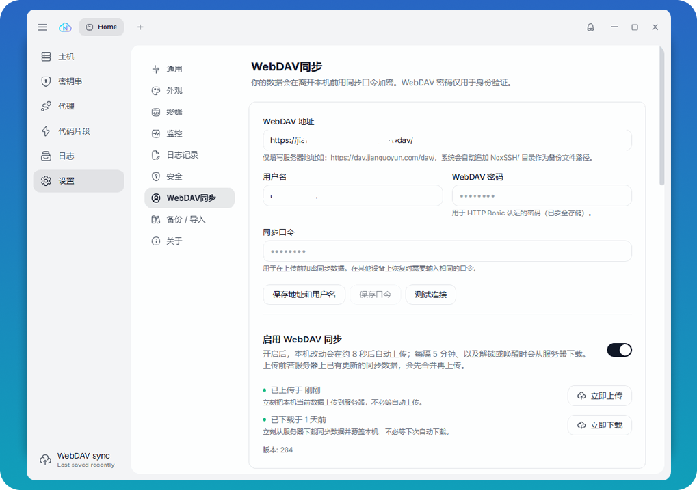
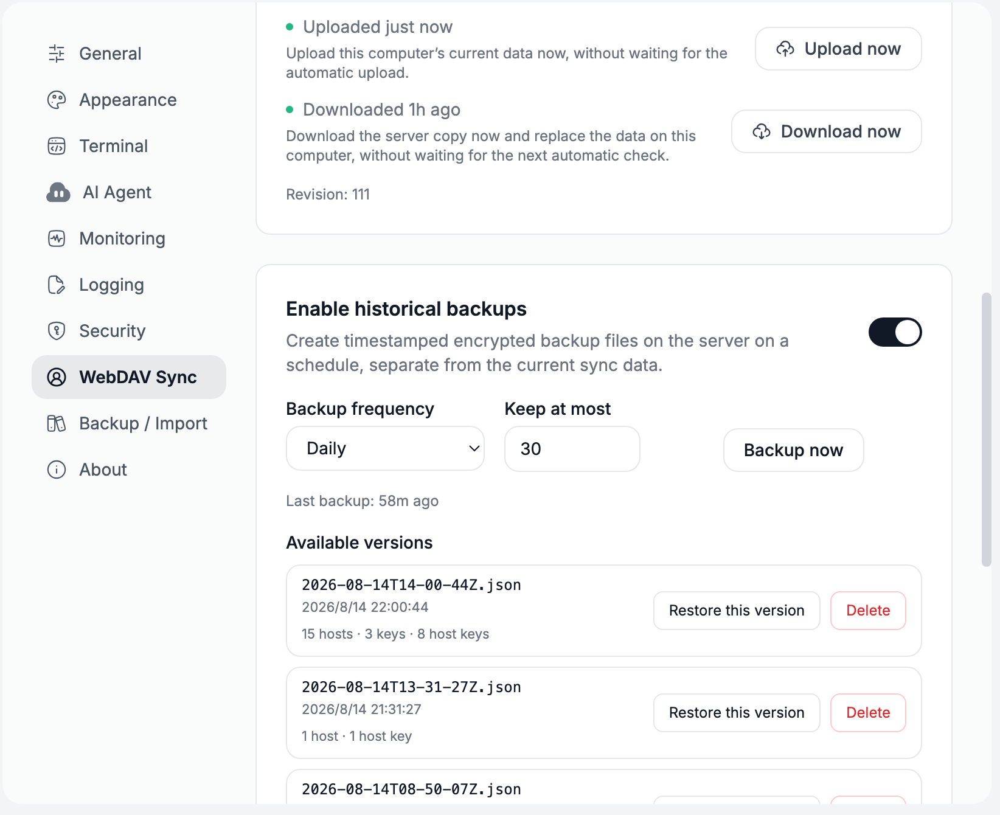
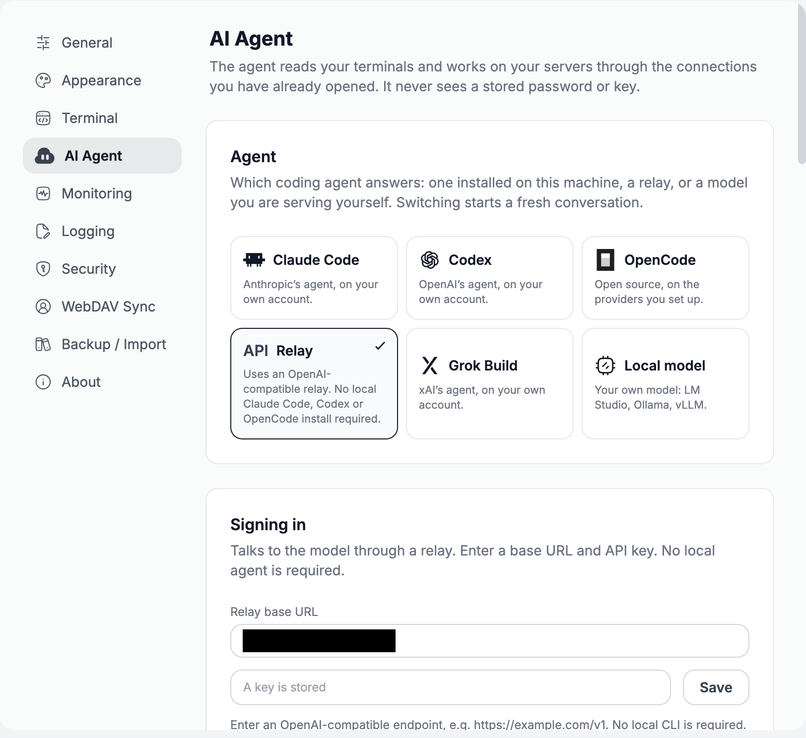

<p align="center">
  
</p>

<h1 align="center">NoxSSH</h1>

<p align="center">
  <strong>SSH、SFTP、Telnet、Windows RDP をひとつの端末に</strong>
</p>

<p align="center">
  Electron、React、xterm.js で作られたモダンなターミナルワークスペース。<br/>
  AI アシスタント · 分割ペイン · タブ · ファイル転送 · ポート転送 · リモートデスクトップ · スニペット
</p>

<p align="center">
  <a href="https://github.com/DT27/NoxSSH/releases/latest"></a>
  &nbsp;
  <a href="#"></a>
  &nbsp;
  <a href="LICENSE"></a>
</p>

<p align="center">
  <a href="./README.md">English</a> ·
  <a href="./README.zh-CN.md">简体中文</a> ·
  <strong>日本語</strong> ·
  <a href="./README.ko.md">한국어</a> ·
  <a href="./README.es.md">Español</a> ·
  <a href="./README.ru.md">Русский</a>
</p>

---

NoxSSH は [CloudTerm](https://github.com/BradPerbs/cloudterm) のフォークです。ターミナル、SFTP、
RDP/VNC、アシスタントはそのままに、データの同期方法を主に変更しています。

## 主な変更点

- **CloudBlast アカウントではなく、自分の WebDAV。** ホスト、フォルダー、鍵、スニペット、プロキシ、既知のホスト、アシスタント設定、ターミナル設定は、この端末で暗号化してから指定した WebDAV にアップロードします。標準の WebDAV ならどれでも使えます。
- **バージョン付き履歴バックアップ**を WebDAV に保存。スケジュールまたは手動。あるバージョンを復元・削除しても、現在の同期データには影響しません。
- **APIゲートウェイ。** AI アシスタントは OpenAI 互換の APIゲートウェイを使え、このマシンに Claude、Codex、OpenCode CLI を入れる必要はありません。
- **NextSSH バックアップのインポート。** PuTTY、KiTTY、MobaXterm、OpenSSH と同じ並びです。
- **テレメトリなし。** 起動時に `console.cloudblast.io` へアクセスしません。更新確認は GitHub の [このリポジトリ](https://github.com/DT27/NoxSSH/releases) を見ます。
  
  
  


---

## 目次

- [ダウンロード](#download)
- [これは何か](#what-it-is)
- [機能](#features)
- [スクリーンショット](#screenshots)
- [はじめに](#getting-started)
- [コミュニティ](#community)
- [貢献者](#contributors)
- [技術スタック](#tech-stack)
- [ライセンス](#license)

---

<a name="what-it-is"></a>

## これは何か

- **ひとつのターミナル**：SSH、telnet、シリアルコンソール。タブ、分割ペイン、GPU 描画。
- **ひとつの SFTP クライアント**：すでに開いている接続を使い、再帰転送とドラッグ＆ドロップ。
- **RDP と VNC**：Windows と Linux を同じアプリに並べる。
- **サーバーを置く場所**：フォルダー、タグ、鍵保管庫、スニペット。すべて暗号化、すべて検索可能。

<a name="features"></a>

## 機能

### AI アシスタント

<p align="center">
  
  &nbsp;&nbsp;&nbsp;&nbsp;&nbsp;&nbsp;
  
  &nbsp;&nbsp;&nbsp;&nbsp;&nbsp;&nbsp;
  
  &nbsp;&nbsp;&nbsp;&nbsp;&nbsp;&nbsp;
  
  &nbsp;&nbsp;&nbsp;&nbsp;&nbsp;&nbsp;
  
  <br/>
  <sub><b>Claude Code</b> &nbsp;·&nbsp; <b>Codex</b> &nbsp;·&nbsp; <b>OpenCode</b>
  &nbsp;·&nbsp; <b>Grok Build</b> &nbsp;·&nbsp; <b>ローカルモデル</b></sub>
</p>

- **すでに入っている Claude Code、Codex、OpenCode、Grok Build** を、自分のアカウントと設定のまま使う
- **ローカルモデルも可**：LM Studio、Ollama、llama.cpp、vLLM など。アカウントも鍵も不要。何もこのパソコンから出ない
- **今見ているセッションを読んでリモートサーバーを操作**。変更の前に確認する
- **会話ごとにモデルと推論の強さを選べる**。実行中に使用量を表示

### ターミナル

- **任意の分割**。1 枚を拡大したり全画面にもできる
- **タブ**に名前・色・グループ。次回起動で復元
- **36 のテーマ**。自分で色を決めてもよい
- **スクロールバック検索**は正規表現対応。リンクはクリックできる
- **入力の一斉送信**。一度の入力をすべてのセッションへ
- **セッション録画**とワンクリックのスクリーンショット

### 接続

- **SSH、telnet、シリアル**を同じウィンドウに
- **ジャンプホスト**で堡塁の先へ
- **パスワード、鍵、SSH agent、証明書**、TPM に置く Windows Hello 鍵
- **二要素認証**のプロンプトを正しく扱う
- **自動再接続**。切断やノート PC の復帰後もつなぎ直す
- **接続時に実行するコマンド**。つながるたびに再生

### ファイルとネットワーク

- **本格的な SFTP マネージャ**：再帰転送、再開、衝突処理、ドラッグ＆ドロップ
- **手元のエディタでリモートファイルを編集**。保存のたびにアップロード
- **ポート転送**：ローカル、リモート、動的 SOCKS5。リアルタイムの通信量
- **リモートデスクトップ**：RDP と VNC をペインに開き、SSH トンネル経由

### 整理

- **フォルダーと色付きタグ**がホスト一覧全体に効く
- **スニペット**は値の入力を求められ、一連の手順としてまとめられる
- **名前、アドレス、タグを即座に検索**
- **既存の `~/.ssh/config` を一度で取り込み**

### オペレーティングシステム

接続時に OS を判別し、ホストカードとタブにそのロゴが出ます。ホスト名を読まなくても
Debian と Fedora を見分けられます。

<p align="center">
  
  
  
  
  
  
  
  
  
  
  
  
  
  
  
  <br/>
  
  
  
  
  
  
  
  
  
  
  
  <br/>
  
  
  
  
  
  
  
  
  
</p>

### セキュリティ

- **暗号化ボルト**にすべての資格情報。起動パスワードは任意
- **ホスト鍵の検証**。接続ごと、ホップごとに確認
- **WebDAV 同期**。アップロード前に同期パスフレーズで暗号化。履歴バックアップは個別に復元・削除
- **暗号化バックアップ**で設定一式を別のマシンへ
- **アクティビティログ**が接続と変更を記録

---

<a name="screenshots"></a>

## スクリーンショット

### ホストとキーチェーン

サーバーはフォルダー、タグ、検索付き。カードにプロトコルが表示されます。WebDAV 同期を
設定すれば、別のパソコンでも同じホストが戻ってきます。


### 分割ペインと SFTP

左にファイル、右に 2 つのシェル。裏は 1 本の接続です。窓の許す限り分割し、
区切りはドラッグできます。


### Windows リモートデスクトップ

Linux セッションの隣のタブに、Windows デスクトップ全体。クリップボードは双方向、
解像度はペインに追従します。


### 好みに合わせる

ターミナルテーマ、アプリの色、フォント、タイトルバーのアイコンまで変えられます。


---

<a name="getting-started"></a>

## はじめに

<a name="download"></a>

### ダウンロード

お使いのプラットフォーム向けの最新版：

| OS      | ダウンロード                                                                                                                                                                                |
| -------- | ------------------------------------------------------------------------------------------------------------------------------------------------------------------------------------------- |
| macOS    | [Apple シリコン（M1 以降）](https://github.com/DT27/NoxSSH/releases/latest/download/NoxSSH-arm64.dmg) · [Intel](https://github.com/DT27/NoxSSH/releases/latest/download/NoxSSH-x64.dmg)   |
| Windows  | [インストーラー、x64（推奨）](https://github.com/DT27/NoxSSH/releases/latest/download/NoxSSH-Setup-x64.exe) · [ポータブル、x64](https://github.com/DT27/NoxSSH/releases/latest/download/NoxSSH-x64.exe) |
| Linux    | [AppImage、x64](https://github.com/DT27/NoxSSH/releases/latest/download/NoxSSH-x86_64.AppImage)                                                                                             |

[GitHub のすべてのリリース](https://github.com/DT27/NoxSSH/releases)も見られます。

### ソースからビルド

```bash
git clone https://github.com/DT27/NoxSSH.git
cd NoxSSH/noxssh
npm install
npm run dev
```

OpenCode で AI アシスタントを使うには、`opencode` CLI を入れ、
`opencode auth login` で少なくとも 1 つのモデルプロバイダーを設定してください。
NoxSSH は OpenCode 既存のプロバイダーと資格情報だけを使い、複製も保存もしません。

ポータブル実行ファイルは `dist/` に出力されます：

```bash
npm run build
```

### ショートカット

|                      |                    |                |            |
| -------------------- | ------------------ | -------------- | ---------- |
| `Ctrl+Shift+F`       | スクロールバック検索 | `Alt+Shift+=`  | 右に分割   |
| `Ctrl+Shift+K`       | スニペットパレット | `Alt+Shift+-`  | 下に分割   |
| `Ctrl+Shift+B`       | 入力の一斉送信     | `Alt+Shift+Z`  | ペイン拡大 |
| `Ctrl+Shift+C` / `V` | コピーと貼り付け   | `Ctrl+Shift+W` | ペインを閉じる |

<a name="community"></a>

## コミュニティ

質問、バグ、要望、これから何をするか知りたいとき。

<p>
  <a href="https://discord.gg/7M84Xp8QBr"></a>
</p>

GitHub の issue と pull request も歓迎します。

<a name="contributors"></a>

## 貢献者

CloudTerm に力を貸したすべての人、そしてここで続けている人に感謝します。

<a href="https://github.com/BradPerbs/cloudterm/graphs/contributors">
  
</a>

<a name="tech-stack"></a>

## 技術スタック

Electron · React · xterm.js · ssh2 · IronRDP（WebAssembly）· noVNC · Tailwind ·
Vite · Claude Agent SDK · Codex SDK · OpenCode SDK

`src/main/` は Electron メインプロセス。機能ごとに 1 モジュール。
`src/renderer/` は React UI：`components/` は機能別、`hooks/` は状態、
`lib/` は純関数。

<a name="license"></a>

## ライセンス

**NoxSSH** は [CloudTerm](https://github.com/BradPerbs/cloudterm) のフォークです。

本プロジェクトは元の [CloudTerm ライセンス](LICENSE)（fair-code）で配布されます。

- ソースは公開され、読めます。
- ソフトウェアは無料で使用、改変、共有（フォークの公開を含む）できます。個人でも社内でも構いません。
- 本ソフトウェアの販売、有料製品・サービスへの組み込み、有料ホストとしての運用、その他の商用配布には、**CloudBlast からの別途商用ライセンスが必要**です。

コピーまたは実質的な部分を配布するときは、元のライセンスと著作権表示を残してください。

この作品が CloudTerm に由来することを正確に述べて構いません。
このプロジェクトを「CloudTerm」と呼んだり、CloudBlast からのものとして装ったりしてはいけません。

全文：[LICENSE](LICENSE) | https://faircode.io

元プロジェクト：https://github.com/BradPerbs/cloudterm（CloudBlast）
